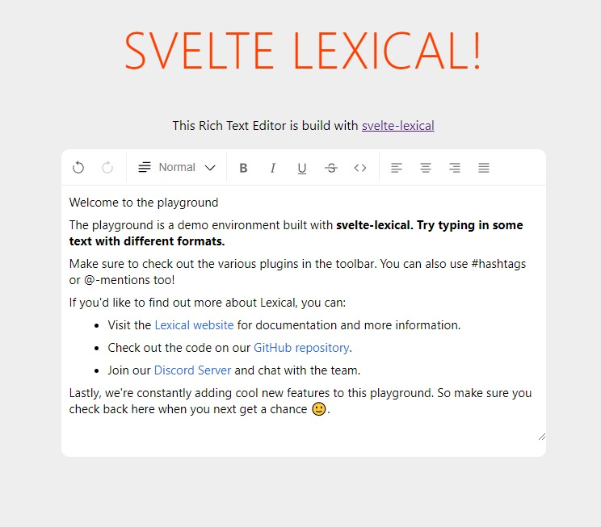

# svelte-lexical

A rich-text editor for Svelte based on [Lexical](https://lexical.dev/)

Lexical is an extensible text editor framework developed by awesome developers at Facebook. The purpose of this project is to provide Svelte bindings for Lexical and also develop high-level components using Lexical.

## Getting Started

Pick one of the demo projects to understand how `svelte-lexical` can be incorporated into your project. For instance, use `demos/sveltekit` for a SvelteKit and `demos/playground` for Svelte.

To run the demo project:

- First build `svelte-lexical` library
  - change directory: `cd packages/svelte-lexical`
  - install dependencies: `pnpm i`
  - build the lib: `pnpm build`
- Run the demo project
  - change directory: `cd ../../demos/playground`
  - run dev: `pnpm dev`

## Development Notes

- This project is set up as a monorepo using pnpm workspaces.
- To run a demo in development, execute <code>pnpm -C demos/playground dev</code>.
- ESLint is set up for VS Code.
- The npm package is automatically published on creation of a GitHub release using GitHub Actions.
- Unit testing is set up for the svelte-lexical package using Jest and Testing Library.
- E2E testing is set up for the playground package using Playwright.
- [Size Limit](https://github.com/ai/size-limit) controls the library size.

## Plugins

Most of the `svelte-lexical` functionality is implemented through plugins. See the [list of plugins here](docs/plugins/readme.md).
